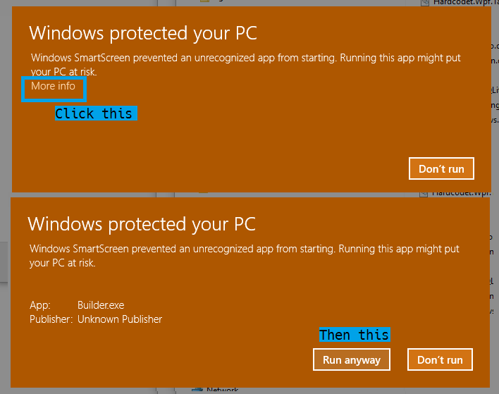

Builder Readme
==============

Introduction
------------

I mostly wrote this for myself both as a programming practice and as a tool that I will use myself on a daily basis.
Because of that, it is tailored to my personal needs, it is by no means a comprehensive UI that will cover 100% of what our build system can do.

The primary focus is on **building** stuff. For source control there is Tortoise hg.
There are a few handy source control features baked into the tool, like triggering a pull, bootstrap, or displaying incoming changes.

**This Application requires .NET Framework 4.6.1 to run.** You can download it [here](https://www.microsoft.com/en-us/download/details.aspx?id=49981) for Windows 7 and later.

Manual
------

### Setting up a new build environment

-   Right Click on the Root Node -&gt; Add -&gt; New Source Directory
-   Specify the Source Directory path, **please include a trailing backslash here** and the stream name, for example platform02-3 or WSG02-5
-   Press OK. The new directory should appear in the Tree. Right Click and select "Bootstrap"
-   This will run the bentleybootstrap script on the directory. It will show a primitive progress bar, and will warn you, if the source directory is not empty.
-   After the bootstrap finished successfully, right click the tree node -&gt; Add -&gt; New Configuration
-   Specify an output directory (trailing backslash) and the name of your build strategy (without the file extension). Change the "Mode" to debug, if intended.
-   Press OK. There should be a new Tree node. Double Click it to open your first bb shell. Input "bb p" to run your initial pull of all repositories.

Known issues
------------

-   It appears on some machines Builder will fail to start shells or builds with administrator permissions. These will then run into an error when they try to create symbolic links. This never happened on my own machine so far.

-   There is a sporadic behavior where build output messages will hang for a few minutes and be flushed out a while later in an instant. During two months of daily usage this only happened twice on my machine. I did not have a chance to debug into this yet.

FAQ
---

### Why it requires Administrator permissions

Our builds require the permission to create symbolic links.
There is two ways to make this work, I decided to just always run this application as administrator.

> The (worse) alternative would require two steps: Allowing all users to create symbolic links in gpedit.msc, and also turning off UAC. [Reference](https://stackoverflow.com/questions/15320550/why-is-secreatesymboliclinkprivilege-ignored-on-windows-8)

If your build fails due to failing permissions to create symbolic links, it will show **A required privilege is not held by the client.**

### SmartScreen

When you launch this App **for the first time**, Windows does everything in its power to prevent you from doing so. SmartScreen will warn you because it does not recognize the App. I'm afraid there is not much I can do about that. It will go away once enough unique machines ran the App, which might never happen :-)

Version History
---------------

### Upcoming Features

**Short term**

-   Search in Part Browser, using wildcards

**Long term**

-   Extract **Warnings and Errors** for each build, write to DB
-   Visual Studio-like **Error List** Window

### Changelog

#### 1.3

-   Improved **Output** Window now buffers text in background
-   Move Up/Down disabled when not possible
-   Emerald Theme
-   PartFile Explorer revisited, it now resolves PartStrategies better
-   New Options:
    -   Show Output Window when a Build Starts
    -   Show Output Window after Failed Build
    -   Enable/Disable Build Logging (currently it is always on)

#### 1.2

-   Visual Studio-like **Output** Window
-   Fixed progress display on bb 2.7

#### 1.1

-   **Improved Part Browser** It can now handle some rare constructs, and does not abort on the first encountered issue

#### 1.0 Initial Release Latest additions

-   **Part Browser**, allow pinning specific parts below a configuration node in the tree so only that part may be build
-   **History** Window displaying Jobs of current session, jump to logfile by double-clicking a row
-   **About-Window** that displays available updates and installed software
-   resolve automatic TCC path on demand instead of scanning on every launch
-   call python in unbuffered mode (sometimes all outputs were sent at the end of the build)

